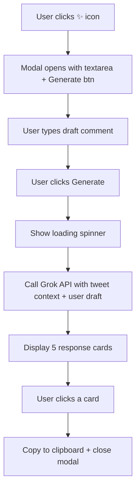

# Design — User-Draft-Driven Reply Generation

## Proposed Solution

Strip out the prefetch/cache system. Rework the modal to have two states: (1) input state with textarea + Generate button, (2) results state with loading then 5 cards. Update the API prompt to take both tweet text and user draft. Keep everything else (icon injection, card selection, clipboard) as-is.

## Flow

## What stays the same

- `getApiKey()` — reads API key from chrome.storage
- `extractMainTweetText()` — grabs tweet text from DOM
- `callGrokAPI()` — updated signature but same endpoint
- Icon injection via MutationObserver
- Modal open/close mechanics
- Card display and clipboard logic

## What changes

- Remove: `responseCache`, `cacheUpdateListeners`, `addCacheUpdateListener`, `notifyCacheUpdate`, `prefetchResponseForCurrentTweet`, `clearStaleCache`, `handleUrlChange`, `initUrlChangeDetection`, `currentTweetUrl`
- Remove: `history.pushState`/`replaceState` interception and polling interval
- Remove: cache-related logic from `openModal()`
- Update: `createModal()` renders textarea + Generate button as initial state
- Update: `callGrokAPI()` accepts `tweetText` and `userDraft` parameters
- Update: system/user prompts to use draft as main direction, tweet as context
- Remove: `isTweetDetailPage()`, `getCurrentTweetUrl()`, `extractTweetText(anchorButton)` if no longer used
